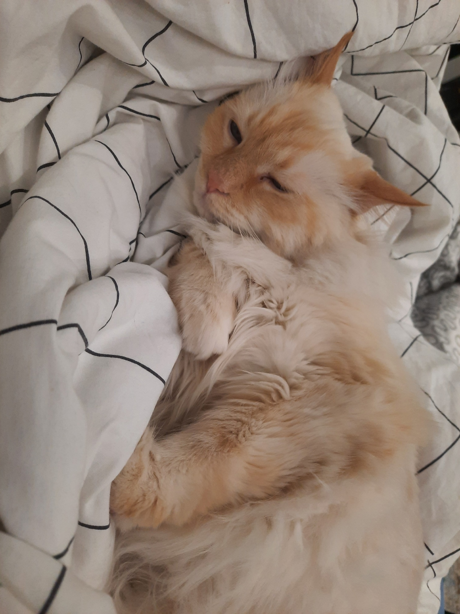

```{r setup, include=FALSE}
knitr::opts_chunk$set(echo = TRUE, message = FALSE, warning = FALSE, error = FALSE, fig.width=16, fig.height=10)

library(tidyverse)
library(ggpubr)
```

## Загрузка данных

```{r}
hogwarts <- read_csv("data/hogwarts_2024.csv")
hogwarts |> head()
```


```{r}
hogwarts |> glimpse()

# Changing some variables type to factors
hogwarts <- hogwarts |> mutate(
  across(c(house, course, sex, wandCore, bloodStatus), ~ as.factor(.x))
)
```

### Поиск пропущенных значений

```{r}
sum(is.na(hogwarts))
```

### Сводка по данным

```{r}
hogwarts |> 
  summary()
```

### Пересоздание theme_custom

```{r}
theme_custom <- theme(
    panel.background = element_rect(fill = "white"),
    plot.title = element_text(size = 30, hjust = 0.5),
    plot.subtitle = element_text(size = 25, hjust = 0.5),
    strip.text = element_text(size = 20),
    axis.text = element_text(size = 20),
    axis.title = element_text(size = 25),
    legend.title = element_text(size = 25),
    legend.text = element_text(size = 20)
  )

se <- function(x){
  sd(x, na.rm=TRUE)/sqrt(length(x))
}
```

**Диаграммы рассеяния (скаттерплоты)**

1. Постройте скаттерплот, визуализирующий связь между суммарным
баллом студента за год и оценкой за экзамен по травологии. Добавьте на
график линию тренда. Удалите доверительную область и сделайте линию
прямой. Подумайте, как избежать того, чтобы записать одни и те же
координаты x и y дважды. Проинтерпретируйте график. (1 б.)

2. Отобразите на одной иллюстрации скаттерплоты, аналогичные тому, что
вы делали на первом задании, для экзаменов по травологии,
магловедению, прорицаниям и зельеварению. На иллюстрации также
должна присутствовать линия тренда с характеристиками, аналогичными
тем, что были в пункте 1. Раскрасьте точки в разные цвета, в соответствии с
факультетами. Используйте стандартные цвета факультетов (как в
лекционных rmd). Проинтерпретируйте полученный результат. (1 б). Если
вы создадите иллюстрацию из этого пункта, используя только пакеты
семейства tidyverse, и не привлекая дополнительные средства, вы
получите дополнительные 0.5 б.

3. Видоизмените график, полученный на предыдущем шаге. Сгруппируйте и
покрасьте линии тренда в соответствии с одной из категориальных
переменных (с такой, которая подсвечивает одно из наблюдений на
предыдущем этапе, относящееся ко всем 4-м экзаменам). Постарайтесь
избежать коллизий в легенде, при этом сохранив и цветовую палитру для
раскраски точек по факультетам. (1 б.)

```{r scatterplot1}

scatterStroke <- hogwarts |> 
  ggplot() +
  geom_point(aes(x = `Herbology exam`, 
                 y = `result`, 
                 fill = factor("Herbology exam")),  
             shape = 21,         
             size = 3,           
             stroke = 1.5,       
             color = "black",    
             alpha = 0.5,  
             position = position_jitter(width = 2, height = 2)) +
  geom_point(aes(x = `Herbology exam`, 
                 y = `result`, 
                 fill = factor("result")), 
             shape = 3,           
             size = 2,          
             color = alpha("mediumpurple2", 0.5),   
             stroke = 1.5,      
             position = position_jitter(width = 2, height = 2)) +
  geom_smooth(aes(x = `Herbology exam`, y = `result`), 
              se = FALSE,        
              method = "lm",     
              color = "blue") +  
  labs(title = "Связь между суммарными очками за год и оценкой за экзамен по травологии",
       x = "Оценка за экзамен по травологии",
       y = "Суммарные очки за год",
       fill = "Баллы") +
  scale_fill_manual(values = c("Herbology exam" = alpha("lightgreen", 0.5), 
                               "result" = alpha("mediumpurple2", 0.5)), 
                    labels = c("Herbology exam" = "Травология", 
                               "result" = "Общий балл")) + 
  theme_custom+
  theme(
    plot.title = element_text(size = 24, hjust = 0.5))

scatterStroke


```

*Интрепретация графика:*
Линия тренда показывает положительную корреляцию, следовательно, студенты с более высокими  баллами по Травологии чаще получают большое количество очков за год. 
Большая часть наблюдений принимает средние значения в диапазоне  ~40-70 баллов за экзамен и ~-50–200 очков за год.

```{r scatterplot2}

hogwarts_long <- hogwarts %>%
  pivot_longer(cols = ends_with("exam"), 
               names_to = "exam_type", 
               values_to = "score")

hogwarts_long_filtered <- hogwarts_long %>%
  filter(exam_type %in% c("Herbology exam", "Muggle studies exam", "Divinations exam", "Potions exam"))


scatterFacets <- hogwarts_long_filtered %>%
  ggplot(aes(x = score, y = `result`, color = house)) +
  geom_point( size = 3, alpha = 0.5) +
  geom_smooth(se = FALSE, method = "lm", color = "blue") +
  facet_wrap(~ exam_type, scales = "free", labeller = labeller(exam_type = c(
    `Herbology exam` = "Травология",
    `Muggle studies exam` = "Маггловедение",               
    `Divinations exam` = "Прорицание",                
    `Potions exam` = "Зельеварение"))) +
  labs(title = "Связь между суммарными очками за год и оценками за экзамены",
       x = "Оценка за экзамен",
       y = "Суммарные очки за год",
       fill = "Факультет")+
  theme_custom +   
  scale_color_manual(name = "Факультет", 
                     labels = c("Gryffindor" = "Гриффиндор", 
                                "Hufflepuff" = "Пуффендуй", 
                                "Ravenclaw" = "Когтевран", 
                                "Slytherin" = "Слизерин"),
                     values = c("Gryffindor" = "#C50000", 
                                "Hufflepuff" = "#ECB939", 
                                "Ravenclaw" = "#41A6D9", 
                                "Slytherin" = "#1F5D25"))

scatterFacets


```

*Интрепретация графика:*
На графиках, иллюстрирующих связь между суммарными баллами за год и оценками за экзамен по Прорицанию, Маггловедению и Травологии, основная часть наблюдений сосредоточена в диапазонах ~40-70 баллов за экзамены и ~-50–200 очков за год. Линия тренда демонстрирует положительную корреляцию, что означает: учащиеся с более высокими годовыми баллами чаще достигают высоких оценок на экзаменах по данным предметам. В среднем ученики Когтеврана имеют более высокие результаты по экзаменам и за год, в то время как Гриффиндор и Пуффендуй стремятся к средним значениям. Учащиеся Слизерина делятся на два кластера: первый включает студентов с самыми низкими оценками за экзамены и отрицательными годовыми баллами, а второй – с высокими результатами, сопоставимыми с когтевранскими. На графике, описывающем зависимость между годовыми баллами и оценками за экзамен по Зельеварению, распределение оценок за экзамен выглядит равномерным, но заметно, что высокие оценки получают в основном (или исключительно) слизеринцы, тогда как студенты остальных факультетов набирают низкие и средние баллы примерно в равных пропорциях. Распределение годовых баллов по факультетам в целом аналогично другим графикам.

```{r scatterplot3}
scatterFacets +
  geom_smooth(aes(color = sex), se = FALSE, method = "lm") +  
  scale_color_manual(name = "Факультет", 
                     labels = c("Gryffindor" = "Гриффиндор", 
                             "Hufflepuff" = "Пуффендуй", 
                             "Ravenclaw" = "Когтевран", 
                             "Slytherin" = "Слизерин",
                             "male" = "Мужчины", 
                             "female" = "Женщины"),
                     values = c("Gryffindor" = "#C50000", 
                             "Hufflepuff" = "#ECB939", 
                             "Ravenclaw" = "#41A6D9", 
                             "Slytherin" = "#1F5D25",
                             "male" = "green", 
                             "female" = "red"))

```

**geom_col и вещи вокруг него**

1. Постройте барплот (столбиковую диаграмму) распределения набранных
баллов за первый семестр (с 1-й по 17-ю неделю включительно) у
студентов разного происхождения. Если у вас возникают трудности,
можете обратиться к шпаргалке по dplyr от posit. Выдвиньте гипотезу (или
гипотезы), почему распределение получилось именно таким. (1 б.)

2. Модифицируйте предыдущий график – отсортируйте столбцы в порядке
убывания суммы баллов. Добавьте на график текстовые метки,
отражающие число студентов каждого происхождения. Попробуйте
использовать для этой задачи не geom_text, а geom_label. Настройте
внешний вид geom_label по своему усмотрению. Поправьте название оси.
Проинтерпретируйте график. Соотносится ли интерпретация с вашей
гипотезой из пункта 1? (1 б.)

3. И снова измените график – добавьте на него разбивку не только по
происхождению, но и по полу. Раскрасьте столбцы по происхождению.
Сделайте подписи к столбцам читаемыми. Дайте графику название,
измените, если требуется, название осей. Сделайте шаг для оси, на
которой отображены очки, через каждую тысячу баллов. Разместите
текстовые метки по правому краю графика. Настройте график таким
образом, чтобы метки были видны целиком и не обрезались. Сохраните
график на устройство.(1.5 б.)

4. Изучите функцию coord_flip() . Как вы думаете, когда она может быть
полезна? Как вы думаете, в чем ее плюсы и минусы? (дополнительные 0.5
б.)

```{r geom_col1}

hogwarts_long <- hogwarts %>%
  pivot_longer(cols = starts_with("week_"), 
               names_to = "week", 
               values_to = "score") %>%
  filter(week %in% paste0("week_", 1:17)) 

bar_plot <- hogwarts_long %>%
  group_by(bloodStatus) %>%
  summarize(total_score = sum(score, na.rm = TRUE)) %>%
  ggplot(aes(x = bloodStatus, y = total_score, fill = bloodStatus)) + 
  geom_col() +
  labs(title = "Распределение набранных очков за первый семестр по происхождению",
       x = "Происхождение",
       y = "Общая сумма очков") +
  scale_fill_manual(name = "Происхождение",
                    labels = c("half-blood" = "Полукровки", 
                                "pure-blood" = "Чистокровные", 
                                "muggle-born" = "Магглорожденные"),
                    values = c("pure-blood" = "royalblue", "muggle-born" = "cyan", "half-blood" = "skyblue")) +  
  theme_custom

bar_plot


```

*Интрепретация графика:*

 Большe всего очков за первый семестр обучения получают полукровки, возможно это связано с распределением количества учеников (больше всего полукровок на которых и приходится бОльшая часть очков)
```{r geom_col2}

bar_plot <- hogwarts_long %>%
  group_by(bloodStatus) %>%
  summarize(total_score = sum(score, na.rm = TRUE), .groups = 'drop') %>%
  mutate(average_score_per_student = case_when(
    bloodStatus == "half-blood" ~ total_score / sum(hogwarts$bloodStatus == "half-blood"),
    bloodStatus == "pure-blood" ~ total_score / sum(hogwarts$bloodStatus == "pure-blood"),
    bloodStatus == "muggle-born" ~ total_score / sum(hogwarts$bloodStatus == "muggle-born")
  ))

# Построение графика
ggplot(bar_plot, aes(x = fct_reorder(bloodStatus, total_score, .desc = TRUE), 
                     y = total_score, 
                     fill = bloodStatus)) +
  geom_col() +
  # Подписи общего количества очков
  geom_label(aes(label = total_score), vjust = 1.5, label.size = 0, show.legend = FALSE, size = 10) +
  # Подписи среднего количества очков на одного ученика
  geom_text(aes(label = paste0("Среднее количество очков: ", round(average_score_per_student, 1))), 
            vjust = -0.5, color = "black", size = 5) +
  labs(title = "Распределение набранных баллов за первый семестр по происхождению",
       x = "Происхождение",
       y = "Общие баллы") +
  scale_fill_manual(name = "Происхождение",
                    labels = c("half-blood" = "Полукровки", 
                               "pure-blood" = "Чистокровные", 
                               "muggle-born" = "Магглорожденные"),
                    values = c("pure-blood" = "royalblue", 
                               "muggle-born" = "cyan", 
                               "half-blood" = "skyblue")) + 
  theme_custom +
  scale_y_continuous(limits = c(0, 10000))


```
*Интрепретация графика:*
Чтобы подтвердить гипотезу о смещении распределения очков из-за разного количества учеников, я добавила расчет среднего количества набранных очков на одного ученика. На графике видно, что чистокровные и магглорожденные получают в среднем больше всего очков, с разницей менее одного балла между группами, в то время как полукровки получают заметно меньше баллов в среднем.

```{r geom_col3}
bar_plot <- hogwarts_long %>%
  group_by(bloodStatus, sex) %>%
  summarize(bloodTotalPoints = sum(score, na.rm = TRUE)) %>%
  mutate(`blood and sex` = paste(bloodStatus, "&", sex))

blood_sex_plot <- ggplot(bar_plot) +
  geom_col(aes(y = fct_reorder(`blood and sex`, bloodTotalPoints, .desc = FALSE), 
               x = bloodTotalPoints,
               fill = bloodStatus)) +
  geom_label(aes(y = fct_reorder(`blood and sex`, bloodTotalPoints, .desc = FALSE), 
                 x = bloodTotalPoints,
                 label = bloodTotalPoints),  
             colour = "black",
             size = 7,  
             hjust = -0.2,  
             fill = alpha("white", 0.7),  
             label.size = 0) +  
  scale_x_continuous(breaks = seq(-1000, 10000, by = 1000),
                     limits = c(-1000, 10000)) +  
  scale_fill_manual(name = "Происхождение",
                    labels = c("half-blood" = "Полукровки", 
                               "pure-blood" = "Чистокровные", 
                               "muggle-born" = "Магглорожденные"),
                    values = c("pure-blood" = "royalblue", "muggle-born" = "cyan", "half-blood" = "skyblue")) +
  labs(
    title = "Распределение очков по происхождению и полу",
    x = "Общие баллы",
    y = "Происхождение и пол"
  ) +
  theme_custom


blood_sex_plot

ggsave("blood_sex_plot.png", blood_sex_plot, width = 16, height = 8, dpi = 300, units = "in")


```

```{r geom_col4}
??coord_flip()

bar_plot <- hogwarts_long %>%
  group_by(bloodStatus) %>%
  summarize(total_score = sum(score, na.rm = TRUE))

ggplot(bar_plot, aes(x = fct_reorder(bloodStatus, total_score), y = total_score, fill = bloodStatus)) +
  geom_col() +
  coord_flip()+
  theme_custom

```
 
 *4* coord_flip() - функция позволяющая поменять местами оси (перевернуть график).  Может быть полезно для создания горизонтальных графиков из вертикальных, что помогает улучшить читаемость меток, особенно если они длинные. Из минусов нужно следить за настройками осей - их нужно переименовать на противоположные. 

**Разное**
1. Сравните распределение баллов за экзамен по зельеварению и за
экзамен по древним рунам. Сделайте это тремя разными способами. Под
разными способами понимаются идеологически разные геомы или
способы группировки. Не считаются разными способами изменения
константных визуальных параметров (цвет заливки, размер фигур) на
сходных в остальном графиках. Объедините графики, таким образом,
чтобы результирующий график имел два столбца и 2 строки. Два графика
должны находиться в верхней строке и занимать равную площадь. Третий
график должен занимать нижнюю строку целиком. (2 б).

2. Визуализируйте средний балл по зельеварению студентов с различным
происхождением. Вы вольны добавить дополнительные детали и
информацию на график. Проинтерпретируйте результат. Как вы думаете,
почему он именно такой? Если у вас есть гипотеза, проиллюстрируйте ее
еще одним графиком (или графиками). Объедините их при помощи
ggarrange. (по 1 б. за первый и график и правильную интерпретацию с
подтверждением в виде второго графика и текстовой аргументации).
Измените порядок ваших фигур на первом графике слева направо
следующим образом: маглорожденные,, чистокровные, полукровки.
Скорректируйте название оси. Если у вас возникают сложности,
обратитесь к шпаргалке по пакету forcats от posit. (Дополнительные 0.5 б.)

```{r other1, fig.height=10, fig.width=16}
library(ggExtra)
library(ggridges)

theme_custom2 <- theme(
    panel.background = element_rect(fill = "white"),
    plot.title = element_text(size = 15, hjust = 0.5),
    axis.text = element_text(size = 12),
    axis.title = element_text(size = 12),
    legend.title = element_text(size = 15),
    legend.text = element_text(size = 11),
    legend.position = "right",  
    legend.box = "horizontal",    
    plot.margin = margin(10, 35, 10, 10)  
)

exam_scores_long <- hogwarts %>%
  pivot_longer(cols = c(`Study of ancient runes exam`, `Potions exam`),
               names_to = "exam", values_to = "score")

# 1. 
histogram_plot <- ggplot(exam_scores_long, aes(x = score, fill = exam)) +
  geom_histogram(alpha = 0.5, color = 'black', position = "identity", bins = 20) +  
  labs(title = "Гистограмма распределения баллов",
       x = "Баллы",
       y = "Частота") +
  scale_fill_manual(name = "Экзамены",
                    values = c(`Study of ancient runes exam` = "darkblue", 
                               `Potions exam` = "darkgreen"), 
                    labels = c(`Study of ancient runes exam` = "Руноведение", 
                               `Potions exam` = "Зельеварение")) + 
  theme_custom2

# 2. 
boxplot_plot <- ggplot(exam_scores_long, aes(y = score, fill = exam)) +
  geom_boxplot(outlier.size = 2, alpha = 0.7) +
  labs(title = "Boxplot для распределения баллов",
       y = "Баллы") +
  scale_fill_manual(name = "Экзамены",
                    values = c(`Study of ancient runes exam` = "darkblue", 
                               `Potions exam` = "darkgreen"), 
                    labels = c(`Study of ancient runes exam` = "Руноведение", 
                               `Potions exam` = "Зельеварение")) +
  theme_custom2

# 3.
scatter_plot <- ggplot(exam_scores_long, aes(x = score, y = exam, color = exam)) +
  geom_point(position = position_jitter(width = 0.1, height = 0.1), alpha = 0.7) +
  labs(title = "Скаттерплот распределения баллов",
       y = "Экзамены",
       x = "Баллы") +
  scale_color_manual(name = "Экзамены",
                     values = c(`Study of ancient runes exam` = "darkblue", 
                                `Potions exam` = "darkgreen"), 
                     labels = c(`Study of ancient runes exam` = "Руноведение", 
                                `Potions exam` = "Зельеварение")) +
  theme_custom2


combined_plot <- ggarrange(
  ggarrange(histogram_plot, boxplot_plot, ncol = 2, widths = c(1, 1)), 
  scatter_plot, 
  ncol = 1, heights = c(1, 1.5)
)

combined_plot

```


```{r other2}
library(forcats)

prepare_data <- function(data) {
  data %>%
    mutate(bloodStatus = fct_recode(bloodStatus,
                                     `Магглорожденные` = "muggle-born",
                                     `Чистокровные` = "pure-blood",
                                     `Полукровки` = "half-blood")) %>%
    mutate(bloodStatus = fct_relevel(bloodStatus, "Магглорожденные", "Чистокровные", "Полукровки"))
}

bar_plot_potions1 <- hogwarts_long %>%
  group_by(bloodStatus) %>%
  summarize(mean_potions_score = round(mean(`Potions exam`, na.rm = TRUE), 0), .groups = 'drop') %>%
  prepare_data()

#1
blood_plot1 <- ggplot(bar_plot_potions1, aes(x = bloodStatus, y = mean_potions_score, fill = bloodStatus)) +
  geom_col() +
  geom_label(aes(label = mean_potions_score), vjust = 1, label.size = 0, show.legend = FALSE, size = 5) +
  labs(title = "Средний балл по зельеварению в зависимости от происхождения",
       x = "Происхождение", y = "Средний балл") +
  scale_fill_manual(name = "Происхождение",
                    values = c("Магглорожденные" = "cyan", 
                               "Чистокровные" = "royalblue", 
                               "Полукровки" = "skyblue")) + 
  theme_custom2+
  scale_y_continuous(limits = c(0, 100))

bar_plot_potions2 <- hogwarts_long %>%
  group_by(bloodStatus, house) %>%
  summarize(mean_potions_score = round(mean(`Potions exam`, na.rm = TRUE), 0), .groups = 'drop') %>%
  mutate(`blood and house` = paste(bloodStatus, "&", house)) %>%
  prepare_data()

#2
blood_plot2 <- ggplot(bar_plot_potions2, aes(x = mean_potions_score, 
                                               y = fct_reorder(`blood and house`, mean_potions_score), 
                                               fill = house)) +
  geom_col() +
  geom_label(aes(label = mean_potions_score), 
             hjust = -0.2, 
             fill = alpha("white", 0.7), 
             label.size = 0, 
             size = 5) +
  labs(title = "Средний балл по зельеварению в зависимости от происхождения и факультета",
       x = "Средний балл", y = "Происхождение и факультет") +
  scale_x_continuous(breaks = seq(0, 100, by = 10), 
                     limits = c(0, 100)) + 
  scale_fill_manual(name = "Факультет", 
                    labels = c("Gryffindor" = "Гриффиндор", 
                               "Hufflepuff" = "Пуффендуй", 
                               "Ravenclaw" = "Когтевран", 
                               "Slytherin" = "Слизерин"),
                    values = c("Gryffindor" = "#C50000", 
                               "Hufflepuff" = "#ECB939", 
                               "Ravenclaw" = "#41A6D9", 
                               "Slytherin" = "#1F5D25")) +
  theme_custom2 

combined_plot <- ggarrange(blood_plot1, blood_plot2, ncol = 1, nrow = 2)


combined_plot


```
*Интерпритация графика*
На верхнем графике видно, что чистокровные студенты имеют самый высокий средний балл по зельеварению (50), за ними идут полукровки (47), а магглорожденные отстают (37).

На нижнем графике студенты Слизерина всех категорий происхождения показывают высокие средние баллы (83–85), тогда как магглорожденные и полукровки из Гриффиндора демонстрируют самые низкие результаты (26–30). Это может говорить о различиях в успехах по зельеварению среди факультетов.
 
**Воспроизведение графика**

1. Дополнительное задание на 4 балла. Воспроизведите график
максимально близко к оригиналу и проинтерпретируйте его.


```{r copy1}

ggplot(hogwarts, 
       aes(x = interaction(sex, house), y = result, fill = house)) +
  geom_violin(scale = "area",
              width = 1.5,
              trim = TRUE, 
              linewidth = 0.7) +  
  geom_boxplot(width = 0.1, 
               outlier.shape = NA,
               fill = "white", 
               color = "grey40") +  
  stat_summary(fun.data = "mean_sdl", 
               geom = "point", 
               shape = 23, 
               size = 8, 
               color = "black", 
               fill = "darkred",
               stroke = 2) +  
  geom_hline(yintercept = 0, linetype = "dashed", color = "brown1", size = 2) +  
  scale_fill_manual(labels = c("Gryffindor" = "Гриффиндор", 
                               "Hufflepuff" = "Пуффендуй", 
                               "Ravenclaw" = "Когтевран", 
                               "Slytherin" = "Слизерин"),
                    values = c("Gryffindor" = "#C50000", 
                               "Hufflepuff" = "#ECB939", 
                               "Ravenclaw" = "#41A6D9", 
                               "Slytherin" = "#1F5D25")
                    ) + 
  scale_y_continuous(breaks = seq(-300, 250, by = 50), 
                     labels = seq(-300, 250, by = 50)) + 
  labs(
    title = "Баллы студентов Хогвартса",
    subtitle = "Распределение числа баллов у студентов различных факультетов Хогвартса в 2023-2024 учебном году",
    x = NULL, 
    y = "Количество очков",
    fill = "Факультет"
  ) +
  facet_wrap(~ sex, ncol = 2, 
             strip.position = "top", 
             labeller = as_labeller(c(female = "Девочки", male = "Мальчики"))) + 
  theme_custom2 +
  theme(
    plot.title = element_text(size = 24, face = "bold", hjust = 0.5, family = "serif"),
    plot.subtitle = element_text(size = 18, hjust = 0.5,colour = "burlywood4"),
    axis.title.y = element_text(size = 20, family = "serif"),
    axis.text.y = element_text(size = 14, family = "serif"),  
    strip.text = element_text( size = 20, family = "serif"),
    legend.position =  c(0.5, 0.15),  
    legend.direction = "vertical",
    axis.text.x = element_blank(),
    legend.title = element_text(size = 22,  family = "serif"),
    legend.text = element_text(size = 18, family = "serif", face = "italic"),
    panel.grid = element_blank(),  
    panel.grid.major.y = element_blank()
  ) +
  guides(fill = guide_legend(override.aes = list(size = 5))) 


```
*В качестве извинений за сдачу после дедлайна держите фотографию моего кота.*


